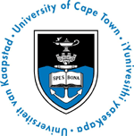

# Data wrangling & manipulation in R 

A workshop by Ruan van Mazijk, for his colleagues at the Department of Biological Sciences, University of Cape Town (UCT), covering common data cleaning, wrangling and wrangling tasks in R, focussing on the [`tidyverse`](https://www.tidyverse.org/) package ecosystem.

This workshop is supported by the [UCT Biological Sciences Postgraduate Committee](https://uctbioscipg.wixsite.com/uctbioscipg) and the [Institute for Communities and Wildlife in Africa (iCWild)](http://www.icwild.uct.ac.za/)

  
  
  
  

The material taught in this workshop is based on Ruan's own experience with the R-packages [`tidyr`](https://tidyr.tidyverse.org/) and [`dplyr`](https://dplyr.tidyverse.org/), and general tidy-data-science principles he learnt from from [R for Data Science, by Garrett Grolemund & Hadley Wickham](https://r4ds.had.co.nz/).

  
  
  

## Disclaimer

This workshop is not affiliated with or supported by the `tidyverse` development team or RStudio and only aims to teach and foster the use of these tools.
