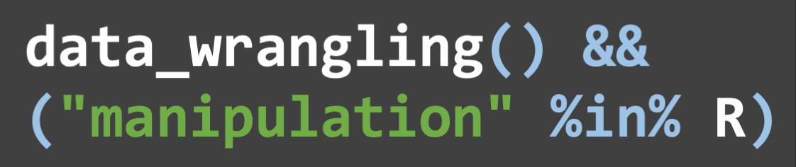

A workshop by Ruan van Mazijk, for his colleagues at the Department of Biological Sciences, University of Cape Town, covering common data cleaning, wrangling and wrangling tasks in R, focussing on the `tidyverse` package ecosystem.

  
  
  
  

[R for Data Science, by Garrett Grolemund & Hadley Wickham](https://r4ds.had.co.nz/)

