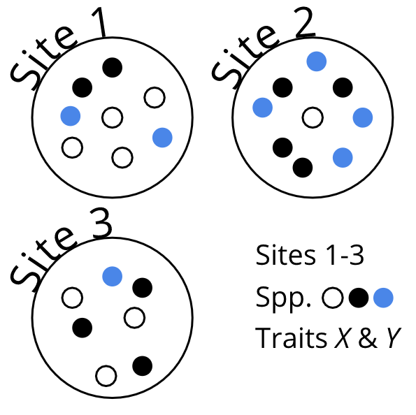
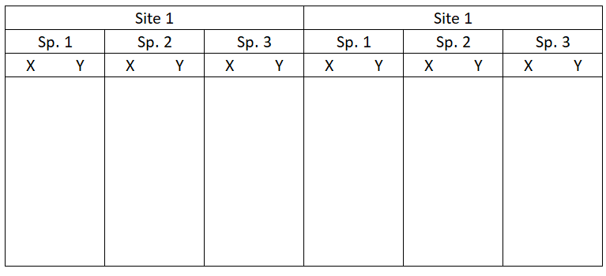
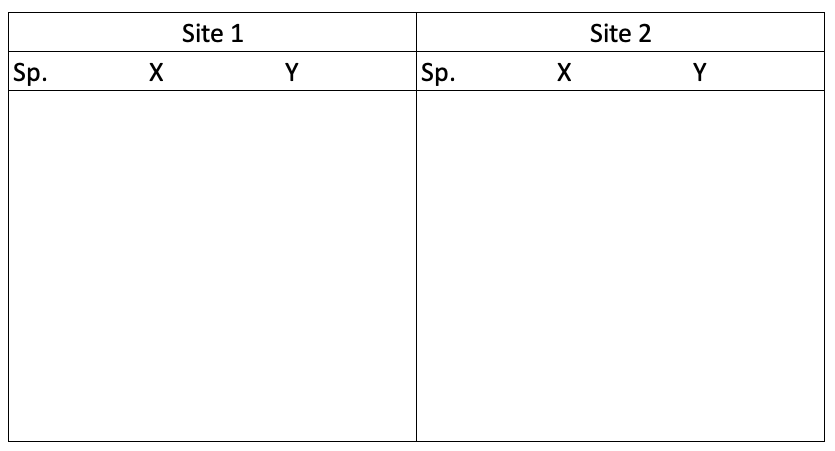
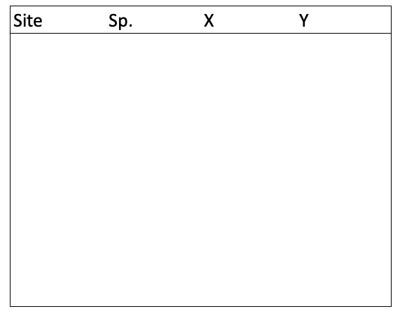

```{r setup, include=FALSE}
knitr::opts_chunk$set(echo = TRUE, eval = TRUE)
library(tidyverse)
```

# Motivation

\pause

```{r data-collection-scenario, echo=FALSE, out.width="7cm", fig.cap="An example data-collection scenario in biology"}

```

***

```{r motivating-example-1, echo=FALSE, out.width="10cm", fig.cap="One way to lay out your collected data..."}

```

***

```{r motivating-example-2, echo=FALSE, out.width="10cm", fig.cap="Another way..."}

```

***

```{r motivating-example-3, echo=FALSE, out.width="7cm", fig.cap="The \"best\" way. Will make your life easiest in the long-term."}

```

# Workshop outline

>- Embracing the rectangle
>- **Making** your data rectangular
>- Things to see & do in rectangle land
>- `mutate()` & friends---How to extend your raw dataset
>- ~~Complicated~~ Exotic problems

# Embracing the rectangle

<!--
TOC:
- Long vs wide data
- The advantages of rectangular data
-->

\pause

## Long vs wide data

Remember this?

```{r motivating-example-again, echo=FALSE, out.width="10cm"}

```

\pause

This is _wide-form_ data. Let's move away from that...

Using the `iris` dataset built into R!

***

## Wide-form data

\pause

```{r wide-output, echo=FALSE}
iris %>%
  split(.$Species) %>%
  map(select, -Species) %>%
  map(slice, 1:2)
```

***

## Classic long-form data

\pause

```{r long-output, echo=FALSE}
iris %>%
  group_by(Species) %>%
  slice(1:3) %>%
  select(Species, Sepal.Length:Petal.Width) %>%
  as.data.frame()
```

***

## We can get longer...

\pause

```{r very-long-output, echo=FALSE}
iris %>%
  group_by(Species) %>%
  slice(1) %>%
  gather(trait, trait_value, -Species) %>%
  ungroup() %>%
  slice(1:15) %>%
  as.data.frame()
```

***

## The advantages of long data

>- Machine-readable
>- The standard for most software/R-functions \
   (e.g. `lm()`, `plot()`, `ggplot()`)
>- How most statistical methods treat data mathematically
>- Easier to subset & wrangle further!

# **Making** your data rectangular

\pause

## What are your options?

1. (Easiest to lay it out like that from the start...)
    - (Many tools (to follow) assume your data is nice & _tidy_)

\pause

2. _Careful_ Excel work
    - Risky...
3. Use R!
    - Many tools _also_ help in _tidying_ data
    - Namely, the package `tidyr`

***
 
## `tidyr::`

An R-package all about getting to _this_\footnote{CC BY-NC-ND 3.0 Grolemund \& Wickham 2017. \textit{R for Data Science}}:

\pause

```{r, echo=FALSE, out.width="10cm"}
knitr::include_graphics("images/tidy-1.png")
```

\pause

> 1. Each **variable** must have its own **column**.
> 2. Each **observation** must have its own **row**.
> 3. Each **value** must have its own **cell**.

***

## `tidyr::` cont.

### Verbs to tidy your data

Untidy observations?

```{r eval=FALSE}
gather()    # if > 1 observation per row
spread()    # if observations live in > 1 row
```

\pause

Untidy variables?

```{r, eval=FALSE}
separate()  # if > 1 variable per column
unite()     # if variables live in > 1 column 
```

***

### Note the following when choosing `tidyr::` verbs

- Be clear on what your **observations** are
    - Like, what **unit** of your study counts as an observation
    - E.g. \textcolor{green}{Leaf traits}: plant leaf vs plant individual
    - E.g. \textcolor{red}{Reproductive success}: egg size vs clutch size
    - **This will depend on your study &/or data!**
- Variables are discrete, seperate ideas

# Things to see & do in rectangle land

## Using `dplyr::` to work with data

1. Subsetting etc.
2. Extending your dataset

***

## `dplyr::`

### Verbs to touch, slice-up, subset & look inside data

```{r, eval=FALSE}
select()  # !!!
filter()  # !!!
group_by()
summarise()
arrange()
join()
mutate()
```

***

### 1. Subsetting etc.

```{r, eval=FALSE}
select()  # !!!
filter()  # !!!
```

***

```{r}
iris
```

#### `select()` vs `$`

```{r}
iris <- as.data.frame(iris)  # like this by default
iris
```

```{r}
iris[, 1]
iris[[1]]
iris[, "Sepal.Length"]
iris[["Sepal.Length"]]
iris$Sepal.Length
```

```{r}
iris["Sepal.Length"]
select(iris, Sepal.Length)
```

***

```{r}
iris <- as_tibble(iris)
iris
```

```{r}
iris[[1]]
iris[["Sepal.Length"]]
iris$Sepal.Length
```

```{r}
iris[, 1]
iris[, "Sepal.Length"]
iris["Sepal.Length"]
select(iris, Sepal.Length)
```

### 2. Extending your dataset with `mutate()` & friends

# ~~Complicated~~ Exotic problems
