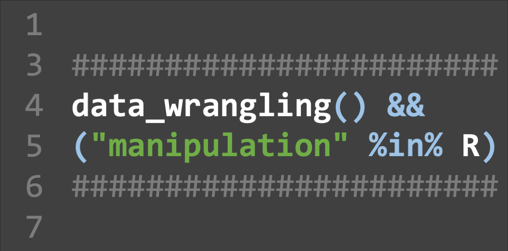
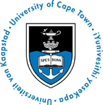
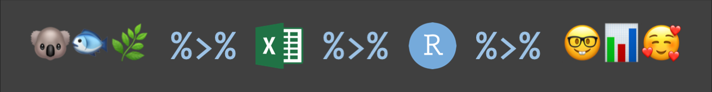

A workshop by [Ruan van Mazijk](https://rvanmazijk.github.io) on common data cleaning, wrangling and wrangling tasks in R, focussing on the [`tidyverse`](https://www.tidyverse.org/) package ecosystem, supported by the [UCT Biological Sciences Postgraduate Committee](https://uctbioscipg.wixsite.com/uctbioscipg) and [iCWild](http://www.icwild.uct.ac.za/).

  
  
  
  

## Workshop outline

**!! UNDER CONSTRUCTION !!**

| Day | Topic                                             |
|:---:|:--------------------------------------------------|
| 1   | Tidy data principles & `tidyr`                    |
| 2   | Manipulating data I: Intro to `dplyr`             |
| 3   | Manipulating data II: `dplyr::mutate()` & friends |

## Further reading

R for Data Science, by Garrett Grolemund & Hadley Wickham (available [online](https://r4ds.had.co.nz/), open source!)

## Disclaimer

This workshop is not affiliated with or supported by the `tidyverse` development team or RStudio and only aims to teach and foster the use of these tools.

