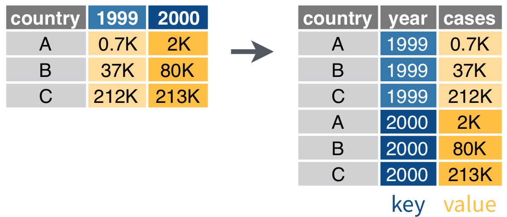
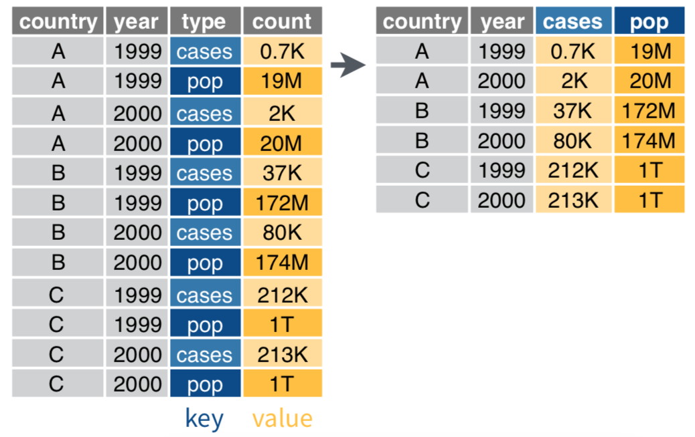
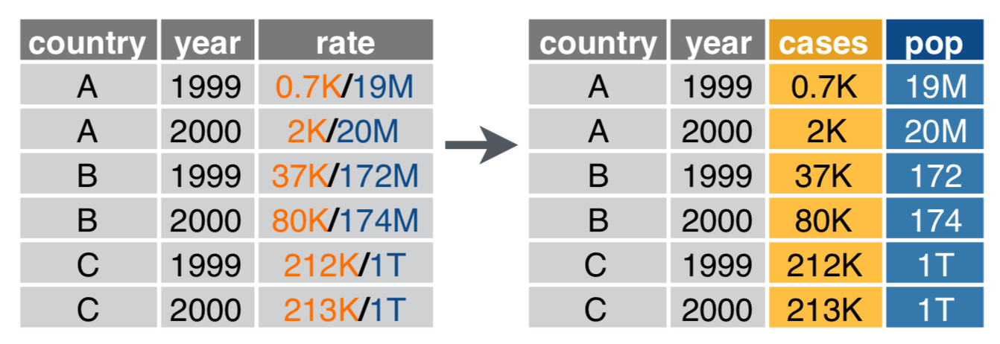
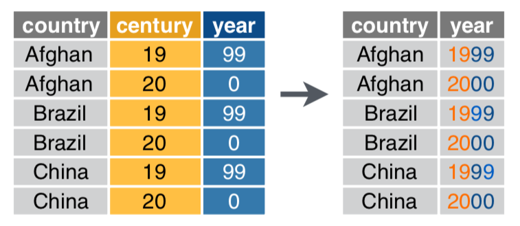

# Day 1 notes: Tidy data principles & `tidyr`

Ruan van Mazijk

## Introducing Ruan

- BSc + Hons here at UCT

- Ecology & evolution
- (Mostly plant) comparative biology
- Biogeography

- Been working with R for 4.5 years
- Every major project I’ve done...

- My MSc is on the relationships between genome-size and plant phenotypes and ecology in CFR _Schoenus_ and _Tetraria_ species (Cyperaceae, tribe Schoeneae)

## Workshop goals

- More reproducible science
- Save time by:
  - Automating repetitive tasks
  - Eliminating human error
- Boost your skills
- Think about your data programmatically

## Workshop outline

| Day | Topic                                                        |
|:---:|:-------------------------------------------------------------|
| 1   | Tidy data principles & `tidyr`                               |
| 2   | Manipulating your data & an intro to `dplyr`                 |
| 3   | Extending your data with `mutate()`, `summarise()` & friends |

But before that, we need to discuss something technical...

## The 2 dialects of R

1. `base`
  - `$`, `[]`, `[[]]`, `apply()`, `which()`, `subset()`
2. `tidyverse`
  - What we are going to learn in this workshop

The `base` way of doing things can sometimes lead to messy R-scripts:

```r
data <- read.csv("my-data.csv")

data1 <- f(data, arg1 = "something")
data2 <- g(data1, another.thing = "blah")
data3 <- h(data2, a.setting = TRUE)
data4 <- data3[data3$a.column == "cough", ]
```

Look at all those intermediate objects we don't care about :cold_sweat:

Or, worse, if we try to remove the intermediate objects, we get **hard to read** code:

```r
data <- read.csv("my-data.csv")

data <-
  h(
    g(
      f(
        data,
        arg1 = "something"
      ),
      another.thing = "blah"
    ),
    a.setting = TRUE
  )

data <- data[data$a.column == "cough", ]
```

And we still can't get rid of that subsetting line easily!

The solution? A handy addition to normal R-syntax: the "pipe" `%>%` (also pronounced "then").

With the pipe, we feed the result of one line of R-code into the next (i.e. we send the result of one expression to the next):

```
f(x)
x %>% f() # same thing
```

This allows us to compose functions really easily!

Instead of this mess:

```r
h(g(f(x)))
```

We can do this:

```r
x %>%
  f() %>%
  g() %>%
  h()
```

Much easier to read! Instead of reading from the inside-out, we can read top-to-bottom :smiley:

## A motivating example


_An example data-collection scenario in biology_

**Collecting** your data like this is fairly practical!


_One way to lay out your collected data..._

But computers will struggle to use this, and so will you, to answer questions about pollinator vs flower abundance!


_Another way..._


_The "best" way. (Will make your life easiest in the long-term._

This is **tidy data**. Moreover, tidy data is defined as follows:


1. Each **variable** must have its own **column**.
2. Each **observation** must have its own **row**.
3. Each **value** must have its own **cell**.

(Image CC BY-NC-ND 3.0 Grolemund & Wickham 2017, _R for Data Science_)

How do we get our data to look this way?

## `tidyr`

An R-package all about getting to this:


`tidyr` provides us with:

## Verbs to tidy your data

```r
# Untidy observations?
gather()    # if > 1 observation per row
spread()    # if observations live in > 1 row

# Untidy variables?
separate()  # if > 1 variable per column
unite()     # if variables live in > 1 column 
```

## Note the following when choosing `tidyr::` verbs

- Be clear on what your **observations** are
    - Like, what **unit** of your study counts as an observation
    - E.g. Leaf traits: plant leaf vs plant individual
    - E.g. Reproductive success: egg size vs clutch size
    - **This will depend on your study &/or data!**
- Variables are discrete, seperate ideas

## Untidy observations?

Use `gather()` if > 1 observation per row

```r
data %>%
  gather(key, value, ...)

data %>%
  gather(key = year, value = cases, `1999`, `2000`)
```



Use `spread()` if observations live in > 1 row

```r
data %>%
  spread(key, value)

data %>%
  spread(key = type, value = count)
```



## Untidy variables?

Use `separate()` if > 1 variable per column

```r
data %>%
  separate(col, into, sep)  # sep's default is any non-alphanumeric character

data %>%
  separate(col = rate, into = c("cases", "pop"))
```



Use `unite()` if variables live in > 1 column

```r
data %>%
  unite(col, ..., sep)  # again, sep's default is any non-alphanumeric character

data %>%
  unite(col = year, century, year)
```




***

Diagrams illustrating `gather()`, `spread()`, `separate()` and `unite()` are taken from RStudio [cheatsheets](https://www.rstudio.com/resources/cheatsheets/) (CC BY SA RStudio)