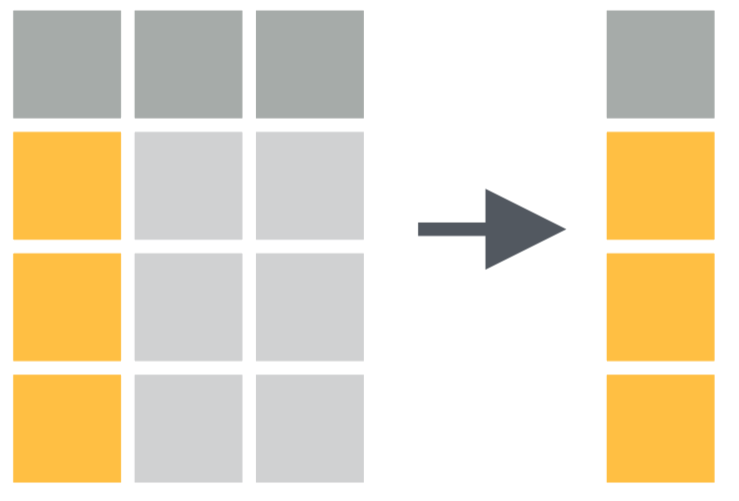
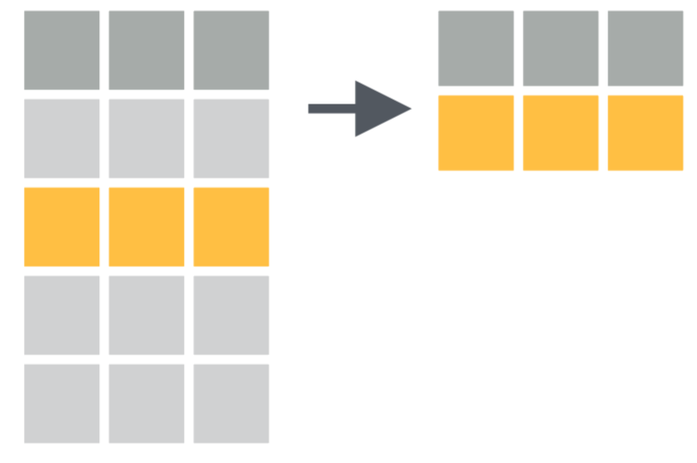

# Day 2 notes: Manipulating your data & an intro to `dplyr`

Ruan van Mazijk

## A note on `base` vs `tidyverse` R data manipulation

```r
data[, columns]
data[rows, ]

data[, 4]
data[, "plantheight"]

data[1:10, ]
data[data$soil == "a", ]
```

Compare these to the `tidyverse`-equivalents, from `dplyr`:

```r
data %>%
  select(plantheight)
data %>%
  filter(soil == "a")
```

## `dplyr`

Verbs to manipulate your data

```r
select()  # operates on columns
filter()  # operates on rows
```

## Examples

```r
data %>%
  select(...)

# These do the same thing:
data %>%
  select(plant_height, soil, lon, lat, veg_type)
data %>%
  select(plant_height:veg_type)
# Think 1:10 but with words!

data %>%
  select(-mean_annual_temp)
# Think data[, -10],
# Or like gather(key, value, -foo)

# These do the same thing:
data %>%
  select(plant_height, plant_weight, plant_LAI)
data %>%
  select(starts_with("plant"))
# See also:
#   contains()   ends_with()  matches()
#   num_range()  one_of()     starts_with()

# We can also select() all columns that satisfy a predicate:
data %>%
  select_if(is.numeric)
# Accepts base R functions (sans "()"):
#   is.logical  is.character  is.numeric
#   is.factor   is.datetime
```



```r
data %>%
  filter(...)

data %>%
  filter(plant_height <= 10)

data %>%
  filter(plant_height <= 10, vegtype == "fynbos")
# Multiple conditions must all be satisfied
# So it "&"s them, so it would be the same as:
data %>%
  filter(plant_height <= 10 & vegtype == "fynbos")

# We can use "or" with the  "|" operator:
data %>%
  filter(plant_height <= 10 | plant_weight >= 60)

# Intervals?
data %>%
  filter(plant_height <= 10 & plant_height >= 0.5)
# There is also a tidy way!
data %>%
  filter(plant_height %>% between(0.5, 10))
```



***

Diagrams illustrating `gather()`, `spread()`, `separate()` and `unite()` are taken from RStudio [cheatsheets](https://www.rstudio.com/resources/cheatsheets/) (CC BY SA RStudio)
