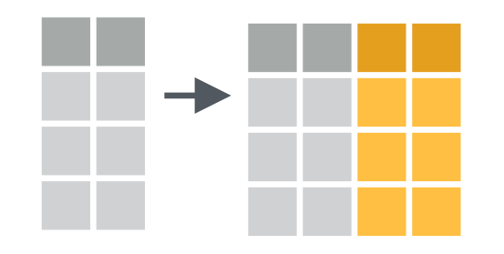
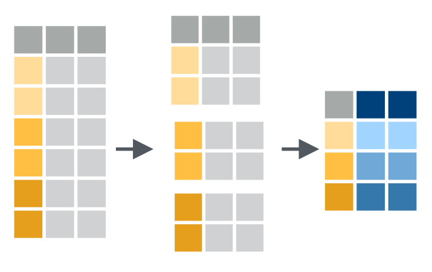

# Day 3 notes: Extending your data with `mutate()`, `summarise()` & friends

Ruan van Mazijk

## An example

(To motivate the next set of `dplyr`-verbs I want to cover.)

```r
data %>%
  gather(key = veg_type, value = fix) %>%
  separate(fix, into = c("lon", "lat")) %>%
  select(veg_type, lon, lat, soil, plant_height) %>%
  filter(plant_height %>% between(0.5, 10),
         veg_type %in% c("fynbos",
                         "strandveld",
                         "renosterveld")) %>%
???()
```

How do we get summary statistics for each vegetation type? With these verbs:

```r
mutate()     # operates on columns
group_by()   # operates on rows
summarise()  # operates on rows (in groups) & columns
```

## Examples: `mutate()` & co.

```r
data %>%
  mutate(...)
data %>%
  mutate(BMI = height / weight)
data %>%
  mutate(BMI = height / weight,
         BMI_std = scale(BMI))
```


```r
data %>%
  mutate_all(.funs, ...)
data %>%
  mutate_all(scale)
data %>%
  mutate_all(list(log, log1p))
```



```r
data %>%
  mutate_if(.predicate, .funs)
data %>%
  mutate_if(is.numeric, scale)
data %>%
  mutate_if(is.numeric, list(log, log1p))
```


## Example: `group_by()` & `summarise()`

```r
data %>%
  group_by(veg_type) %>%
  summarise(mean_plant_height = mean(plant_height),
            st_plant_height = sd(plant_height))
data %>%
  group_by(veg_type) %>%
  summarise_if(is.numeric, mean)
data %>%
  group_by(veg_type) %>%
  summarise_if(is.numeric, mean, na.rm = TRUE)
data %>%
  group_by(veg_type) %>%
  summarise_if(is.numeric, list(mean, sd))
```



***

Diagrams illustrating `gather()`, `spread()`, `separate()` and `unite()` are taken from RStudio [cheatsheets](https://www.rstudio.com/resources/cheatsheets/) (CC BY SA RStudio)
